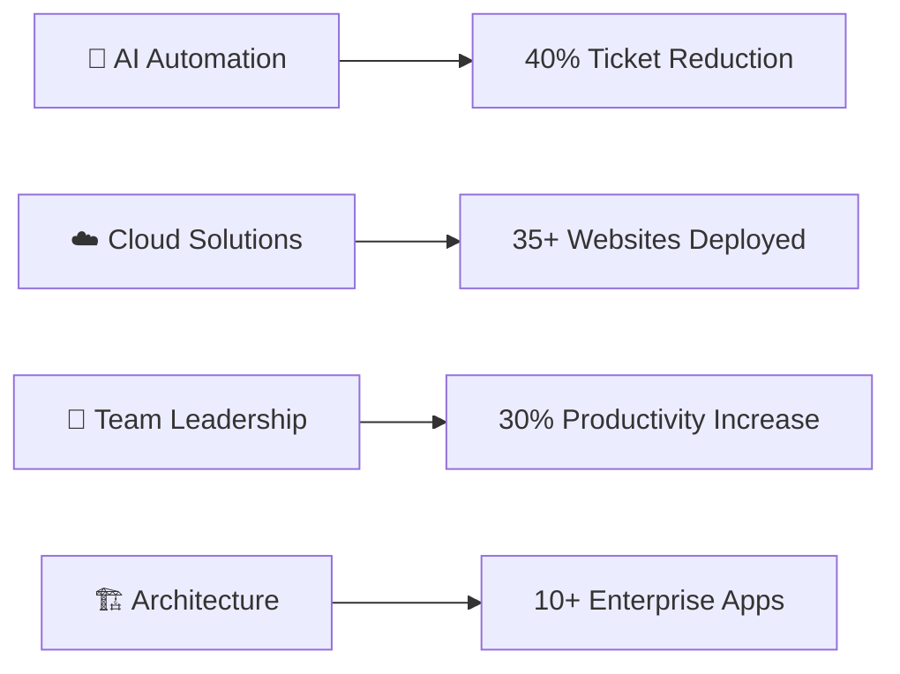
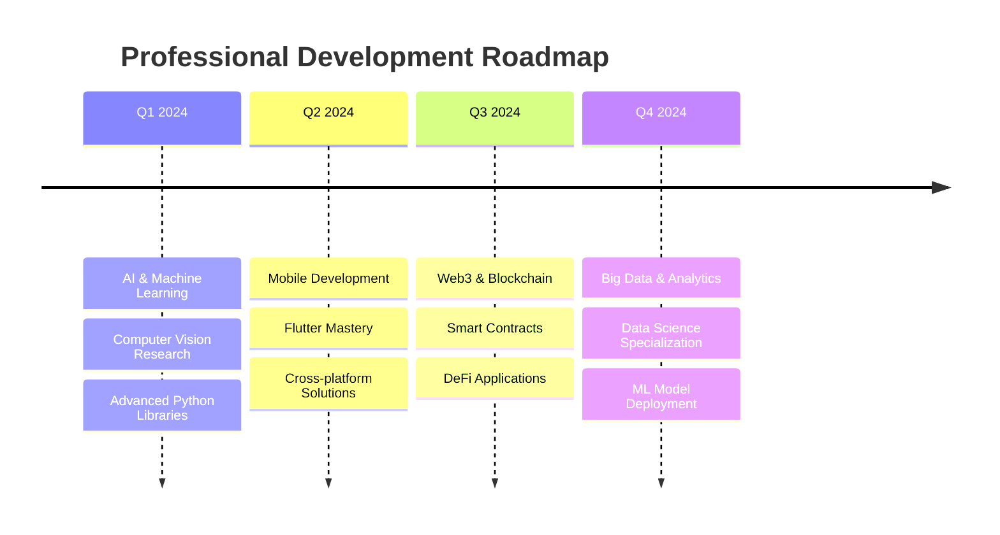

<div align="center">

# 🚀 Jose Julio Bohórquez
### Full-Stack Developer | Cloud Architect | AI Automation Specialist

[](https://git.io/typing-svg)

[](https://github.com/JoseBohorquez)
[](https://github.com/JoseBohorquez)
[](https://github.com/JoseBohorquez)

</div>

---

## 🎯 Professional Summary

> **Innovative Full-Stack Developer** with **5+ years** of experience specializing in **AI automation**, **cloud architecture**, and **scalable web solutions**. Passionate about transforming business processes through intelligent automation and cutting-edge technology.

<div align="center">

| 🎯 **Focus Areas** | 📊 **Impact** | 🚀 **Expertise** |
|:--:|:--:|:--:|
| AI & Automation | 40% Ticket Reduction | 5+ Years Experience |
| Infrastructure & Systems | Linux/Windows Servers | Expert Administration |
| Cybersecurity & Security | Google Certified | Security Analysis & OWASP |
| Contact Center Solutions | Genesys Cloud Platform | Call Center Optimization |
| Cloud Architecture | 35+ Websites Built | Multi-Cloud Certified |
| Team Leadership | 30% Productivity Boost | Agile Methodologies |

</div>

---

## 🏆 Key Achievements & Impact

<div align="center">



</div>

### 🎯 **Business Impact Highlights**
- 🤖 **AI-Powered Automation**: Developed conversational bots with **Genesys Cloud**, **WhatsApp**, and **VAPI AI**, achieving **40% reduction** in GLPI tickets
- 📊 **Process Optimization**: Automated workflows using **n8n**, **Make**, and **Python**, integrated with **Active Directory** and **Moodle**
- 🏗️ **Scalable Architecture**: Delivered **10+ enterprise applications** and **35+ websites** for corporate and government clients
- ☁️ **Infrastructure Excellence**: Managed **Linux/Windows servers**, **AWS**, **Azure**, and **GCP** with **Docker** and **Kubernetes** deployments
- 🔐 **Security Excellence**: **Google Cybersecurity Certified** specialist implementing secure development practices with **SonarQube**, **OWASP** standards, and security analysis
- 📞 **Contact Center Solutions**: Expert administration of **Genesys Cloud** platform, call center optimization, and customer experience enhancement
- 🖥️ **Systems Administration**: Complete management of **on-premise** and **cloud infrastructure**, including **Active Directory**, **VMware**, and **Proxmox**
- 👥 **Technical Leadership**: Led teams of 5 developers, achieving **+30% productivity** through agile methodologies

---

## 🎓 Education & Certifications

<div align="center">

| 🎓 **Degree/Certification** | 🏫 **Institution** | 📅 **Year** | 🏆 **Status** |
|:--|:--|:--:|:--:|
| **Systems Engineering** | Universidad del Tolima | 2029 | 🔄 In Progress |
| **Software Development Technology** | SENA | 2026 | 🔄 In Progress |
| **Software Programming Technician** | SENA | 2024 | ✅ Completed |
| **Cybersecurity Specialist** | Google/Coursera | 2024 | ✅ Certified |
| **Oracle Next Education Bootcamp** | Alura Latam | 2023 | ✅ Completed |
| **Genesys Cloud Professional** | Genesys | 2024 | ✅ Certified |

</div>

---

## 💼 Current Role & Responsibilities

<div align="center">

### 🏢 **Software Developer** @ *Alianza - Servitel*
**📅 November 2024 - Present**

</div>

```yaml
Role_Focus:
  - Custom_Solutions: "Multi-department business solutions"
  - Automation: "n8n & Python workflow automation"
  - Integration: "Active Directory, GLPI, Moodle systems"
  - Security: "Secure development practices with SonarQube"
  - Deployment: "Cloud infrastructure management"
```

---

## 🚀 Featured Projects

<div align="center">

| 🌐 **Project** | 🔗 **Link** | 📋 **Description** | 🛠️ **Tech Stack** |
|:--|:--:|:--|:--|
| **Code2355** | [🔗 Visit](https://code2355.online) | Development Portfolio & Services | React, Node.js, AWS |
| **Servitech** | [🔗 Visit](https://servitech.website) | Technical Solutions Platform | Laravel, Vue.js, MySQL |
| **Tacos Capital** | [🔗 Visit](https://tacoscapital.online) | Restaurant Management System | Flutter, Firebase, GCP |

</div>

---

## 💻 Technology Stack & Skills

### 🔥 **Core Competencies**

<div align="center">


</div>

### 🔧 **Programming Languages**
<div align="center">


</div>

### 🌐 **Frontend Technologies**
<div align="center">


</div>

### ⚙️ **Backend & APIs**
<div align="center">


</div>

### 🖥️ **Infrastructure & Systems Administration**
<div align="center">


</div>

### ☁️ **Cloud & DevOps**
<div align="center">


</div>

### 📞 **Contact Center & Communication Platforms**
<div align="center">


</div>

### 🔐 **Cybersecurity & Security**
<div align="center">


</div>

### 🗄️ **Databases & Storage**
<div align="center">


</div>

### 🤖 **AI & Automation Tools**
<div align="center">


</div>

### 🛠️ **Development Tools**
<div align="center">


</div>

---

## 📊 GitHub Analytics & Performance

<div align="center">

### 📈 **Contribution Overview**


### 🔥 **Coding Streak**


### 💻 **Language Distribution**


</div>

---

## 🏆 GitHub Achievements & Trophies

<div align="center">


</div>

---

## 📈 Contribution Activity

<div align="center">


</div>

---

## 🎯 Professional Goals & Roadmap 2024-2025

<div align="center">



</div>

### 🚀 **Key Focus Areas**
- 🤖 **AI & Machine Learning**: Deep dive into automation and intelligent systems
- 🔍 **Computer Vision & NLP**: Research and practical applications
- 📱 **Advanced Mobile Development**: Flutter expertise and cross-platform solutions
- 🌐 **Web3 & Blockchain**: Exploring decentralized applications and smart contracts
- 📊 **Big Data & Data Science**: Specialization in analytics and ML model deployment

---

## 🌐 Connect & Collaborate

<div align="center">

### 📫 **Let's Build Something Amazing Together!**

[](https://linkedin.com/in/josebohorquez)
[](https://twitter.com/josebohorquez)
[](mailto:jose.bohorquez@example.com)
[](https://code2355.online)

### 💬 **Available for:**
- 🚀 **Freelance Projects** | 🤝 **Collaborations** | 💼 **Full-time Opportunities**
- 🎯 **Technical Consulting** | 📚 **Mentoring** | 🗣️ **Speaking Engagements**

</div>

---

## 💰 Support My Work

<div align="center">

**If you find my projects helpful, consider supporting my work! ☕**

[](https://buymeacoffee.com/josebohorquez)
[](https://paypal.me/yosefstrong)
[](https://ko-fi.com/josebohorquez)

</div>

---

<div align="center">

### 💭 *"Code is poetry written in logic, and every bug is just a plot twist waiting to be resolved."* 

**🌟 Transforming Ideas into Digital Reality | One Line of Code at a Time 🌟**

---

**⭐ Star my repositories if you find them useful!**  
**🔔 Follow for updates on my latest projects and tech insights**


</div>
